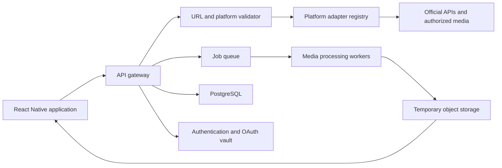

# Social Media Downloader

## Product Plan and Technical Proposal

**Status:** Planning  
**Target platforms:** Android and iOS  
**Mobile framework:** React Native with Expo and TypeScript

## 1. Product vision

Social Media Downloader is a creator-focused application for backing up,
organizing, downloading, and converting media that a user owns or has permission
to use.

The application should not be positioned as a tool for downloading arbitrary
copyrighted media or removing watermarks from somebody else's content. In this
plan, **without watermark** means retrieving an authorized original asset that
does not contain a watermark. The application will not digitally erase an
existing watermark or bypass DRM, access controls, private accounts, or regional
restrictions.

### Proposed value proposition

> Back up, organize, and convert media you own from one secure application.

## 2. Product goals

- Give creators a simple way to save their own social media posts.
- Support photos, videos, Reels, Stories, and audio conversion where authorized.
- Preserve the best available authorized quality and original metadata.
- Allow users to import files directly from their device.
- Provide clear download progress, history, retry, and sharing controls.
- Delete temporary server copies automatically.
- Build every platform integration as an independent adapter so it can be
  maintained or disabled without breaking the entire application.

## 3. Non-goals and compliance boundaries

The initial product will not:

- Download private media without the account owner's authorization.
- Request or store social platform passwords or session cookies.
- Circumvent DRM, signatures, CAPTCHAs, geographic restrictions, or platform
  security controls.
- Remove an existing creator or platform watermark from downloaded media.
- Download or extract YouTube audio without YouTube's written authorization.
- Promise support for unofficial integrations that cannot pass platform or app
  store review.

Apple requires explicit authorization before an application saves, converts, or
downloads media from third-party sources. Google Play also prohibits applications
that encourage unauthorized downloading of copyrighted works. YouTube separately
prohibits downloading audiovisual content or separating its audio without prior
written approval.

References:

- [Apple App Review Guidelines, sections 5.2.2 and 5.2.3](https://developer.apple.com/app-store/review/guidelines/)
- [Google Play Intellectual Property policy](https://support.google.com/googleplay/android-developer/answer/9888072?hl=en)
- [YouTube API Services Developer Policies](https://developers.google.com/youtube/terms/developer-policies)

## 4. Platform feasibility

| Platform | Proposed capability | Initial release decision | Important limitation |
| --- | --- | --- | --- |
| Instagram | Connected user's photos, videos, Reels, and eligible Stories | MVP candidate | Official access primarily supports eligible professional Business or Creator accounts; arbitrary consumer-account downloads are not promised. |
| Facebook | Media belonging to a connected user or managed Page | Discovery / Phase 2 | Requires appropriate Meta permissions and App Review. Arbitrary public Story and video downloads are excluded. |
| X | Authorized media from connected accounts and permitted posts | MVP candidate | Use the official X API, its media variants, and the applicable access tier. |
| TikTok | Account connection, video listing, embeds, and export assistance | Phase 2 | The Display API exposes video metadata and embed links, not a universal watermark-free download service. |
| Douyin | Approved connected-account operations | Research | Requires Douyin OAuth, approved scopes, and assessment of China-specific operational requirements. |
| Xiaohongshu / XHS | Authorized creator export if an official partnership becomes available | Research | No dependable general-purpose official download path should be assumed. |
| YouTube | Import metadata or open content in YouTube | No download support | YouTube-to-MP3 is excluded unless written authorization is obtained. The app may extract audio from a local file supplied by the user. |

Official integration references:

- [Meta Instagram API collection](https://www.postman.com/meta/instagram/documentation/6yqw8pt/instagram-api)
- [X API media data dictionary](https://docs.x.com/x-api/fundamentals/data-dictionary)
- [TikTok Display API overview](https://developers.tiktok.com/doc/display-api-overview/)
- [Douyin authorization overview](https://open.douyin.com/platform/resource/docs/develop/permission/overall-permission/)

## 5. Recommended MVP

### User-facing features

1. Email, Apple, or Google authentication.
2. Paste-link input with automatic platform detection.
3. Import photos and videos from the user's device.
4. Instagram professional-account connection.
5. X account connection and supported media lookup.
6. Media preview with creator, type, duration, size, and quality information.
7. Authorized download with quality and format selection.
8. Extract MP3 or M4A audio from a local video supplied by the user.
9. Download queue with progress, retry, cancel, and failure details.
10. Download history and direct sharing to another application.
11. Automatic deletion of temporary server files after a short retention period.
12. Ownership confirmation and links to the copyright and acceptable-use policies.

### Suggested screens

- Onboarding and acceptable-use confirmation
- Sign in / create account
- Home and paste-link input
- Connected accounts
- Media preview and format selector
- Active downloads
- Download history
- Local media converter
- Storage and privacy settings
- Help, copyright report, and account deletion

## 6. System architecture



### Recommended technology stack

| Area | Recommendation |
| --- | --- |
| Mobile | React Native, Expo, TypeScript |
| Navigation | Expo Router |
| Server state | TanStack Query |
| Local UI state | Zustand |
| Local persistence | Expo SQLite or secure key-value storage, depending on the data |
| Backend | Node.js with NestJS or Fastify |
| Database | PostgreSQL |
| Background jobs | Redis and BullMQ |
| Media processing | FFmpeg workers for authorized user-supplied media |
| Temporary files | S3-compatible object storage with lifecycle deletion |
| Authentication | Managed authentication plus platform OAuth 2.0 |
| Monitoring | Structured logs, crash reporting, performance monitoring, and alerts |

## 7. Platform adapter design

Each integration should implement a common contract:

```ts
export interface PlatformAdapter {
  readonly platform: Platform;

  validateUrl(url: string): boolean;
  getMetadata(input: MediaInput, user: UserContext): Promise<MediaMetadata>;
  verifyAuthorization(
    metadata: MediaMetadata,
    user: UserContext,
  ): Promise<AuthorizationResult>;
  getAuthorizedFormats(
    metadata: MediaMetadata,
    user: UserContext,
  ): Promise<MediaFormat[]>;
  prepareDownload(
    request: DownloadRequest,
    user: UserContext,
  ): Promise<DownloadJob>;
}
```

The adapter registry allows a platform to be disabled remotely if its API,
permissions, or terms change. Feature availability must still be declared in the
application and store listing; remote configuration must not hide material
functionality from app review.

## 8. Download workflow

1. The application normalizes the submitted URL.
2. The API validates the hostname against an explicit allowlist.
3. The adapter retrieves metadata through an official or explicitly authorized
   integration.
4. The backend verifies the connected account, ownership, permission, and media
   availability.
5. The user sees the available formats, estimated size, and retention notice.
6. A job is added to the queue.
7. The worker downloads or processes the authorized media.
8. The result is stored temporarily and exposed through a short-lived signed URL.
9. The mobile application saves the file using platform-approved storage APIs.
10. The temporary copy expires automatically, and the job keeps only minimal
    operational metadata.

Where an official source URL can be used safely, a direct source-to-device flow is
preferred to reduce server storage and bandwidth.

## 9. Security and privacy requirements

- Store OAuth refresh tokens encrypted and never include them in application logs.
- Never request platform passwords, cookies, or browser-session exports.
- Allowlist supported hosts and block private, loopback, link-local, and cloud
  metadata addresses to prevent server-side request forgery.
- Limit URL redirects and validate the destination after every redirect.
- Apply per-user, per-IP, and per-platform rate limits.
- Validate MIME type, file signature, duration, resolution, and maximum size.
- Use short-lived signed download URLs.
- Encrypt network traffic and sensitive stored data.
- Automatically expire temporary media, failed jobs, and abandoned uploads.
- Provide account deletion, connected-account revocation, and data export flows.
- Record auditable consent and ownership confirmation without retaining the media
  longer than necessary.
- Add abuse reporting, copyright complaints, and a repeat-infringer process before
  public launch.

## 10. Suggested project structure

```text
apps/
  mobile/
    app/                  # Expo Router routes
    src/
      components/
      features/
      hooks/
      services/
      stores/
      theme/
      types/
  api/
    src/
      auth/
      downloads/
      media/
      platform-adapters/
      users/
workers/
  media-worker/
packages/
  contracts/              # Shared API schemas and TypeScript types
  config/
  validation/
infrastructure/
docs/
```

The structure is a proposed monorepo layout for a new project. It should be
adopted during scaffolding rather than retrofitted after implementation has begun.

## 11. Delivery roadmap

### Phase 0: Product and compliance discovery — 1 to 2 weeks

- Select launch countries and target audience.
- Confirm the business model and whether the application is public or internal.
- Register platform developer accounts.
- Request required API permissions and document approval requirements.
- Complete a legal and app-store feasibility review.
- Produce final user flows, wireframes, and acceptance criteria.

**Exit criterion:** at least one official social integration is viable, and the
MVP scope does not rely on hidden or unofficial scraping.

### Phase 1: Foundation — 2 to 3 weeks

- Set up the monorepo, mobile application, API, worker, database, and CI.
- Implement authentication, user profiles, consent, and account deletion.
- Add platform adapter contracts and feature flags.
- Establish logging, monitoring, test conventions, and deployment environments.

### Phase 2: Core MVP — 4 to 6 weeks

- Build paste-link detection and media preview.
- Add local file import and authorized local audio extraction.
- Implement the download queue, progress, retry, cancel, and history.
- Add temporary object storage and lifecycle deletion.
- Complete the first approved platform adapter.

### Phase 3: Official integrations — 3 to 5 weeks

- Add Instagram professional-account support.
- Add X media support where permitted.
- Complete Meta/Facebook feasibility work.
- Add OAuth renewal, revocation, platform-specific rate limiting, and error states.

### Phase 4: Quality and store release — 2 to 3 weeks

- Run Android and iOS device testing.
- Test large files, network loss, low storage, backgrounding, and interrupted jobs.
- Perform privacy, security, accessibility, and localization reviews.
- Prepare store metadata and clear App Review notes with authorization evidence.
- Release through TestFlight and Google Play closed testing before production.

**Estimated compliant MVP:** approximately 10 to 16 weeks for two engineers with
part-time product design and quality assurance support. Platform approval time is
external and may extend the schedule.

## 12. Testing strategy

- Unit tests for URL normalization, domain allowlists, validators, and adapters.
- Contract tests against recorded, sanitized official API responses.
- Integration tests for OAuth, queueing, storage expiry, and signed URLs.
- End-to-end tests for import, preview, download, conversion, retry, and deletion.
- Device tests covering supported Android and iOS versions.
- Security tests for malicious redirects, oversized files, MIME spoofing, and
  unauthorized object access.
- Operational tests for API changes, rate limits, expired tokens, queue backlog,
  and unavailable platform services.

## 13. Business model

The recommended positioning is creator productivity and archival:

- **Free:** limited local imports, conversions, and downloads.
- **Pro:** higher limits, batch operations, cloud backup, and longer history.
- **Creator Teams:** shared libraries, permissions, and brand workspaces.
- **Business:** licensed migration, archival, and media-management workflows.

Advertising should not be the main business model around third-party downloaded
content. Do not charge per unauthorized public download.

## 14. Success metrics

- Percentage of submitted links resolved through authorized integrations.
- Successful download rate by platform and application version.
- Median time from link submission to saved file.
- Download retry and failure rate.
- Temporary-file deletion success rate.
- Seven-day and thirty-day creator retention.
- OAuth connection and revocation success rate.
- Copyright complaints, abuse reports, and store-review incidents.

## 15. Principal risks and mitigations

| Risk | Impact | Mitigation |
| --- | --- | --- |
| Platform API or terms change | Integration stops working | Independent adapters, monitoring, versioned contracts, and remote disable controls |
| App Store rejection | Product cannot launch on iOS | Obtain written authorization and provide it during review; keep unsupported downloads out of the binary |
| Copyright abuse | Legal and store-account exposure | Ownership confirmation, permitted sources, reporting, repeat-infringer policy, and rapid takedown handling |
| High bandwidth and processing cost | Reduced margins | Direct-to-device downloads, size limits, lifecycle deletion, and paid batch processing |
| OAuth token compromise | Account and privacy impact | Encryption, token isolation, least privilege, rotation, and revocation |
| Malicious URLs or files | Backend compromise | Strict host allowlist, SSRF controls, file validation, sandboxed workers, and resource limits |
| Unofficial scraper dependency | Frequent failures and policy exposure | Do not make unofficial scraping part of the public-store MVP |

## 16. Launch decision

The recommended launch scope is:

1. Local media import and audio extraction for user-supplied files.
2. Instagram professional-account media where the approved API permits it.
3. X media where official API access and usage terms permit saving it.
4. A secure download manager, history, sharing, and temporary storage lifecycle.

TikTok, Facebook, Douyin, and XHS should be released only after each integration
has an official API path or written platform authorization. YouTube-to-MP3 must
remain outside the public product unless YouTube gives prior written approval.

