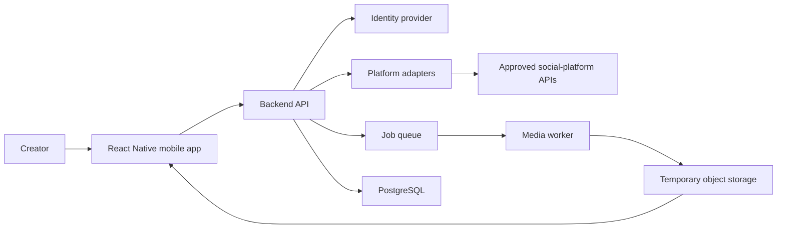
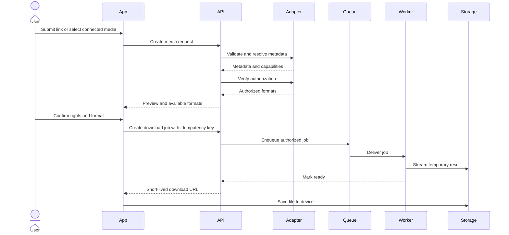

# Architecture

**Status:** Proposed  
**Architecture style:** Modular mobile client, stateless API, asynchronous workers

## 1. Context

The system imports, resolves, downloads, or converts media that a user owns or is
authorized to use. Social integrations must use official APIs or explicit written
authorization. The architecture isolates each platform because capabilities,
permissions, rate limits, and media URLs can change independently.

## 2. System context



## 3. Proposed components

### Mobile application

- React Native, Expo, and TypeScript.
- Expo Router for navigation.
- TanStack Query for server state and request lifecycle.
- Zustand for small amounts of local UI state.
- Secure platform storage for application credentials and device-only secrets.
- Native document, media-library, file-system, and share APIs.

The mobile client does not contain platform client secrets, call privileged social
APIs directly, or execute downloaded code.

### Backend API

- Node.js with NestJS or Fastify.
- Validates authentication, input, URL host, authorization, quota, and job state.
- Exchanges OAuth codes using server-held client secrets.
- Issues short-lived signed URLs for completed authorized files.
- Remains stateless apart from PostgreSQL, Redis, and object storage.

### Platform adapter registry

Every platform implements a shared adapter contract for URL validation, metadata,
authorization, formats, and job preparation. Adapters expose capabilities rather
than assuming every platform supports every feature.

```ts
type PlatformCapabilities = {
  accountConnection: boolean;
  linkResolution: boolean;
  imageDownload: boolean;
  videoDownload: boolean;
  storyAccess: boolean;
  audioExtraction: boolean;
};
```

### Job queue

- Redis with BullMQ is the initial proposal.
- Jobs have explicit states: `queued`, `authorizing`, `processing`, `ready`,
  `failed`, `cancelled`, and `expired`.
- Idempotency prevents duplicate processing caused by retries.
- Queue limits protect platform quotas and processing capacity.

### Media worker

- Runs in an isolated container with CPU, memory, time, and disk limits.
- Uses FFmpeg only for authorized user-supplied media and permitted transformations.
- Validates actual file signatures rather than trusting response headers.
- Writes outputs directly to temporary object storage.
- Cannot access the main database with unrestricted credentials.

### PostgreSQL

Proposed core entities:

- `users`
- `social_connections`
- `media_requests`
- `download_jobs`
- `media_objects`
- `consent_records`
- `abuse_reports`
- `audit_events`

Raw OAuth tokens are not stored in ordinary application columns. Store encrypted
token material through a managed secret mechanism or envelope encryption.

### Temporary object storage

- Private buckets only.
- Short-lived signed read URLs.
- Automatic lifecycle deletion.
- Separate prefixes or buckets by environment.
- Server-side encryption and restricted service identities.

## 4. Primary processing sequence



## 5. Trust boundaries

1. Device to public API.
2. Public API to social platforms.
3. API to worker queue.
4. Worker to untrusted remote media.
5. Worker to object storage.
6. Administrative access to production services.

All remote URLs and media are untrusted. The worker network policy should allow
only required public destinations and deny private networks and cloud metadata
services.

## 6. Deployment model

Initial environments:

- **Local:** containerized dependencies and emulated storage where practical.
- **Staging:** isolated cloud resources and platform test applications.
- **Production:** separate identities, databases, queues, buckets, and secrets.

The API and workers deploy independently. Autoscaling is based on API traffic,
queue depth, CPU, and processing duration. Platform-specific concurrency limits
must remain below approved quotas.

## 7. Observability

- Structured logs with correlation, request, user, adapter, and job identifiers.
- Metrics for latency, resolution, authorization, queue depth, processing time,
  output size, deletion, and failure codes.
- Distributed traces across API, queue, worker, and storage operations.
- Alerts for deletion failures, elevated authorization errors, queue backlog,
  token-refresh failures, and unexpected platform response changes.
- Logs must redact URLs containing tokens, authorization headers, signed URLs,
  cookies, filenames containing personal information, and media contents.

## 8. Scalability and cost controls

- Prefer approved direct-to-device delivery where safe and permitted.
- Stream files rather than loading complete media into memory.
- Enforce size, duration, resolution, and daily usage limits.
- Deduplicate only within the boundaries allowed by privacy and platform terms.
- Expire completed artifacts quickly.
- Separate interactive jobs from batch processing if batch features are introduced.

## 9. Failure handling

- Map platform failures into stable internal error codes.
- Retry only transient failures with bounded exponential backoff and jitter.
- Do not retry authorization, unsupported-media, or policy-denied failures.
- Revalidate authorization before retrying an expired media URL.
- Send exhausted jobs to a dead-letter path for safe inspection.
- Make cancellation cooperative and remove partial objects.

